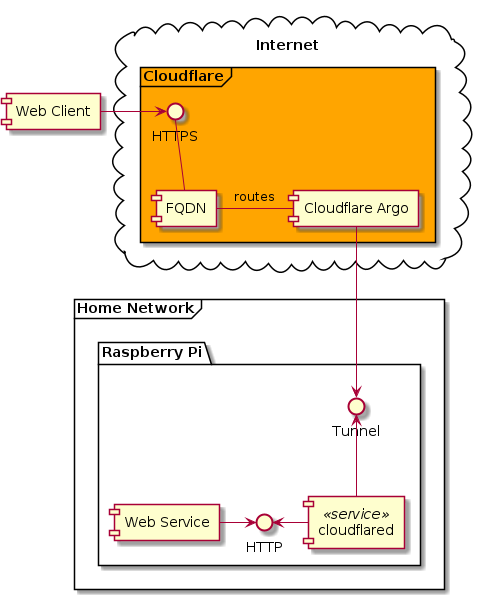

# Architecture

Tools for creating architecture diagrams
1. Plantuml with graphviz using VS Code plugin
2. Drawio using VS Code plugin

## Home Assistant using Cloudflare Argo

Self hosting [Home Assistant](https://www.home-assistant.io/getting-started/) service on raspberry pi and exposing that to the internet via [Cloudflare Agro Tunnel](https://developers.cloudflare.com/argo-tunnel/reference/docker/) 

